# Restaurant Suggestion and Management Application

## Introduction and Features

The goal of this application was to develop a back-end management application using Spring Boot and Java to realize the management of a restaurant chain along with their respectively served cuisines. Each restaurant under the chain is independent and has its unique name, a list of cuisines & chefs, a rating and its geological information. For each chef in each restaurant, his/her corresponding name, salary and specialized cuisine(s) are also appropriately stored and managed. 

The implemented features include the following:

* **Add new restaurants**: realized through a POST Mapping onto "/restaurants" which contains all the details for restaurants as well as an automatically generated restaurant_id (used as the primary key in the database).
* **Update details in existing restaurants**: realized through a PUT Mapping to "/restaurants/restaurant_id=*some_id*" to update all the details for a given restaurant (as specified by the corresponding restaurant_id).
* **Delete existing restaurants**: realized through a DELETE Mapping on "/restaurants/restaurant_id=*some_id*" to delete the given restaurant which corresponds to the restaurant_id provided in the request.
* **Search restaurant based on restaurant attributes**: realized through a GET Mapping on '/restaurants/restaurant_id=*some_id*' or '/restaurants?*some_restaurant_attribute*' which will return the restaurant(s) that satisfy the searching criteria (which could contains either single or multiple parameters).
* **Search chefs based on restaurant_id or cuisines**: realized through a GET Mapping on '/chefs?restaurant_id=*some_id*' and/or another search criteria based on a restaurant attribute. The search based on only chef attributes (such as Chef's name / cuisines / salary) is also implemented.

## Implementation Stacks

- ​	Java 1.8

- ​	Spring Boot 2.4.5

- ​	Spring Data JPA

- ​	Spring Data REST

- ​	Spring HATEOAS

- ​	Hibernate

- ​	H2 Database

- ​	Maven


## Architecture

### Class

- Restaurant
- RestaurantService
- Chef
- ChefService
- LoadDatabase
- DemoApplication

### Interface/Repository

- RestaurantRepository
- ChefRepository

### Controller

- RestaurantController

### Query (Specifications)

- RestaurantSpecification
- ChefSpecification

### Exception Handling

- RestaurantNotFoundAdvice
- RestaurantNotFoundException


## Test

### Running

`$ mvn clean spring-boot:run`

### Testing

- **POST**

```sh
curl -iX POST localhost:8080/restaurants -H 'Content-type:application/json' -d '{"restaurant_name":"Bowl", 
	"restaurant_cuisines": ["chinese", "indian"], 
	"restaurant_chefs": 
		[{"chef_name":"abcd", 
			"chef_salary":2500, 
			"chef_cuisines":["indian", "chinese"]}], 
	"restaurant_rating":9, 
	"restaurant_city":"waterloo", 
	"restaurant_province":"ON"}' 
```

```shell
curl -iX POST localhost:8080/restaurants -H 'Content-type:application/json' -d '{"restaurant_name":"chinaBowl", 
	"restaurant_cuisines": ["indian", "italian"], 
	"restaurant_chefs": 
		[{"chef_name":"efgh", 
			"chef_salary":2800, 
			"chef_cuisines":["indian","italian"]}], 
	"restaurant_rating":8, 
	"restaurant_city":"cambridge", 
	"restaurant_province":"ON"}'

```

​		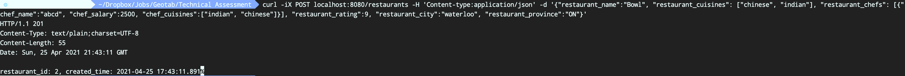

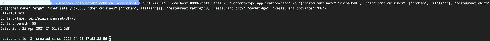

* **PUT**

```sh
curl -iX PUT localhost:8080/restaurants/2 -H 'Content-type:application/json' -d 
'{"restaurant_name":"Bowl", 
	"restaurant_cuisines": ["chinese", "italian"], 
	"restaurant_chefs": [{
		"chef_name":"abcd", 
		"chef_salary":2500, 
		"chef_cuisines":["italian", "chinese"]}], 
	"restaurant_rating":, 
	"restaurant_city":"markham", 
	"restaurant_province":"ON"}'
```


* **GET**
  1. Search Restaurant

Search restaurant based on restaurant_id: `http://localhost:8080/restaurants/2`

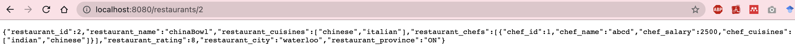


Search restaurant based on restaurant_name: `http://localhost:8080/restaurants?restaurant_name=chinaBowl`

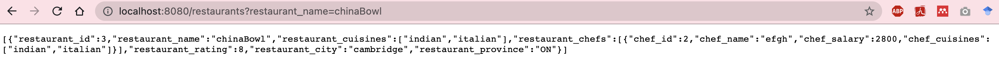


Search restaurant based on restaurant_city: `http://localhost:8080/restaurants?restaurant_city=markham`

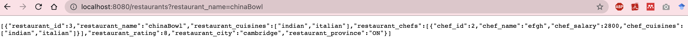


Search restaurant based on restaurant_province: `http://localhost:8080/restaurants?restaurant_province=ON`

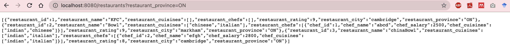


Search restaurant based on restaurant_rating: `http://localhost:8080/restaurants?restaurant_rating=8`

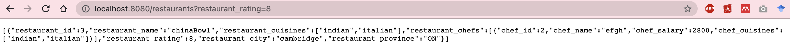


Search restaurant based on restaurant_cuisine: `http://localhost:8080/restaurants?restaurant_cuisines=indian`

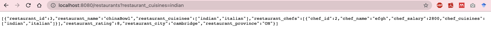


Search restaurant based on restaurant_cuisine and rating: `http://localhost:8080/restaurants?restaurant_cuisines=italian&restaurant_rating=9`

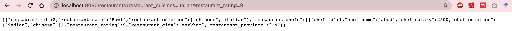


  		2. Search Chef

Search chef based on restaurant_id: `http://localhost:8080/chefs?restaurant_id=2`


Search chef based on restaurant_id & cuisine: `http://localhost:8080/chefs?restaurant_id=2&cuisine=indian`


Search chef based on restaurant_id & name: `http://localhost:8080/chefs?restaurant_id=2&name=abcd`


Search chef based on (chef's) name: `http://localhost:8080/chefs?name=abcd`

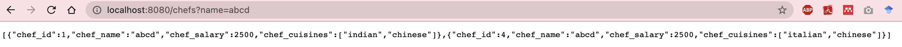


Search chef based on (chef's) cuisine: `http://localhost:8080/chefs?cuisine=indian`

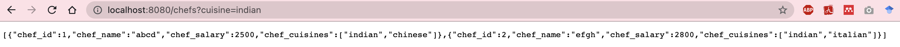


* **Delete**

  ```shell
  curl -iX DELETE localhost:8080/restaurants/2
  ```

  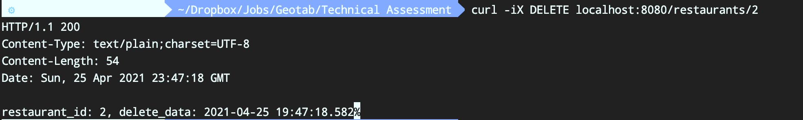


### Future work

* Restrict input values for restaurant parameters by using ENUM for province / city / rating (such as 1-10)
* Add a UML diagram to clearly show the class dependencies and structures
* Implement unit tests using JUnit 
